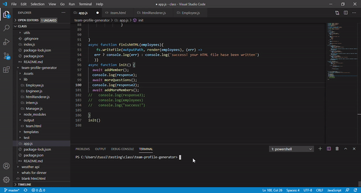

  
  # team-profile-generator
 
  ## Description
  This project focuses on the use of object oreinted programing or OOP. With the use of OOP you can write constructors that will allow following objects to inherit the properties of the constructor without having to write the same code over and over.
  
  ## Table of Contents
  - [Title](#Title)
  - [Description](#description)
  - [Table of Contents](#table-of-contents)
  - [Screenshot](#screenshots)
  - [Installation](#installation)
  - [Usage](#usage)
  - [Testing](#testing)
  - [Additional Information](#additional-information)
  - [License](#license)
  - [Contributing](#contributing)
  - [Questions and Feedback](#questions-and-feedback)

  ## Installation
   To run, simply clone the repo, run npm i to download modules, and then run node app.js.

  ## Usage
  This project will be used to create a team.html file to display the members of the team.

  ## Technologies Used:
  I used node.js, node modules inquirer, and fs, as well as OOP.

  ## Code Sample
  As shown in the example code, I used asynchronous functions to call the functions and used inherited constructor properties to build my employee objects.
  

  ## Screenshot
  

  ## License
  MIT License - see the [LICENSE.txt](https://github.com/tussingj89/team-profile-generator/blob/main/LICENSE.txt) file for details
  
  ## Testing 
  To test this project, simply run - npm run test, which will run all tests, or run npm test "file location" to run a specific test.

  ## Contributing
  When contributing to this repository, please first discuss the change you wish to make via issue, email, or any other method with the owners of this repository before making a change.
  
  ## Questions and Feedback
  Please contact me using one of the following:
  - Github: [tussingj89](https://gist.github.com/tussingj89)
  - Email: tussing40@gmail.com
